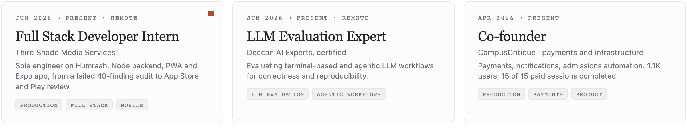
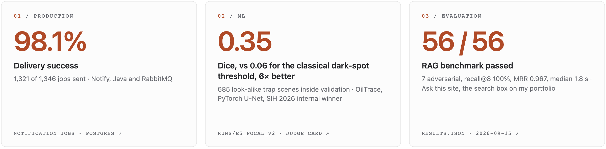
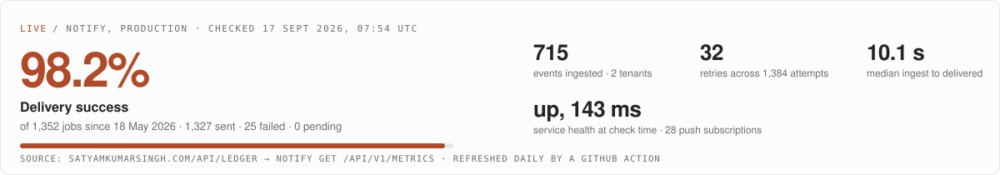
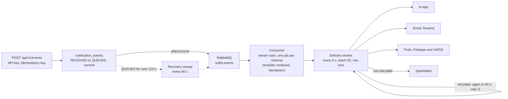
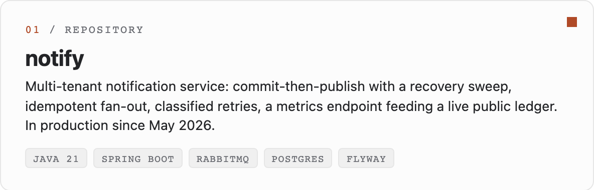
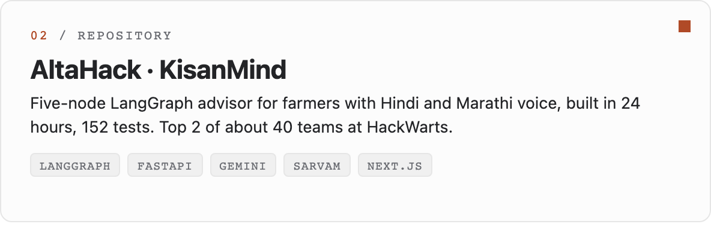
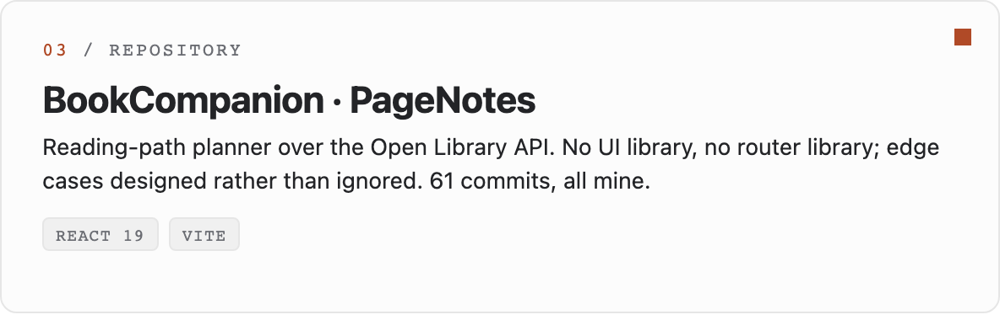
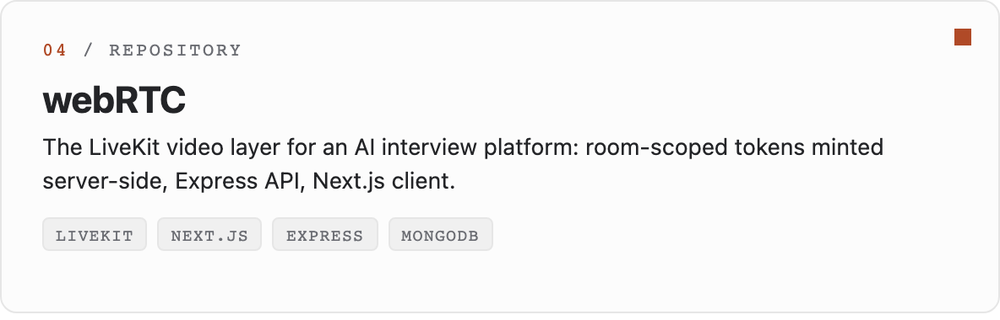

<picture>
  <source media="(prefers-color-scheme: dark)" srcset="assets/banner-dark.png">
  
</picture>

  
  
  

I build agents and RAG systems, ship the full stack around them (Java, Node, React, React Native), and evaluate LLM workflows for a living. Second-year B.Tech CSE (AI) at Vedam School of Technology, Pune. Every number on this page links to the query, run file or commit that produced it.

## Now

<picture>
  <source media="(prefers-color-scheme: dark)" srcset="assets/now-dark.png">
  
</picture>

## Measured

<a href="https://satyamkumarsingh.com/#measured"><picture>
  <source media="(prefers-color-scheme: dark)" srcset="assets/measured-dark.png">
  
</picture></a>

<a href="https://satyamkumarsingh.com/contact#ledger"><picture>
  <source media="(prefers-color-scheme: dark)" srcset="assets/live-dark.svg">
  
</picture></a>

## How Notify works

The system behind the 98.1%. A product posts an event and gets a 202; everything after that is Notify's problem.

<b>The six decisions, one line each</b>

- **Commit, then publish, then sweep.** The event row is the outbox; a stale `QUEUED` row is the signal to republish. No distributed transaction.
- **Idempotent at every hop.** Idempotency key at ingest; `existsByEventIdAndChannel` plus a unique constraint at fan-out; row lock at claim.
- **Claim and finalise one job at a time**, each in its own transaction, so one failure cannot roll back deliveries that already happened.
- **Failures are classified by the handler** (`DeliveryException(message, retryable)`); the worker retries exactly what can change on a retry.
- **Off by default.** Email and push stay disabled until credentials exist; misconfiguration fails startup, not delivery at 2am.
- **Templates in Postgres per tenant**, versioned by Flyway migration, with a render-test endpoint.

Source: [Satyam087/notify](https://github.com/Satyam087/notify) · write-up: [What 1,346 notification jobs taught me about async delivery](https://satyamkumarsingh.com/writing/1346-notification-jobs)

<b>What broke, and what changed because of it</b>

| Where | What | Then |
|---|---|---|
| Notify | 25 of 1,346 jobs failed, all email and push | Failure classification, three attempts with backoff, a public failed-jobs view and a live delivery rate |
| OilTrace | Early runs collapsed to predicting nothing (Dice 0.00, precision 1.00) | Focal loss on the wrong pixels, 685 trap scenes moved into validation, a sealed test set never used for a decision |
| CampusCritique | 15 June: a one-line guard routed every payment webhook to the refund handler, and returned 200 | Verify, key, guard, then act; side effects moved out of the request; [the write-up](https://satyamkumarsingh.com/writing/webhook-refund-handler) |
| Humraah | 40 findings in a product that looked finished | Auth rebuilt, media made private, 35 fixed, 5 accepted as non-blocking, then store review |

## Repositories worth opening

<table><tr>
<td width="50%"><a href="https://github.com/Satyam087/notify"><picture><source media="(prefers-color-scheme: dark)" srcset="assets/repo-1-dark.png"></picture></a></td>
<td width="50%"><a href="https://github.com/Satyam087/AltaHack"><picture><source media="(prefers-color-scheme: dark)" srcset="assets/repo-2-dark.png"></picture></a></td>
</tr><tr>
<td width="50%"><a href="https://github.com/Satyam087/BookCompanion"><picture><source media="(prefers-color-scheme: dark)" srcset="assets/repo-3-dark.png"></picture></a></td>
<td width="50%"><a href="https://github.com/Satyam087/webRTC"><picture><source media="(prefers-color-scheme: dark)" srcset="assets/repo-4-dark.png"></picture></a></td>
</tr></table>

Elsewhere: [OilTrace](https://github.com/TrueMan08/Team_AlgoRise_OilSpill_detection) (the detector, service and dashboard, every training run's history committed) · [AskMyNotes](https://github.com/VKS0104/AskMyNotes-AlgoRise) (first place, Noesis Hackathon; I co-built the retrieval). The portfolio itself is a private repo; [how it works](https://satyamkumarsingh.com/site) is public.

## Writing

<!-- BLOG-POST-LIST:START -->- [What 1,346 notification jobs taught me about async delivery](https://satyamkumarsingh.com/writing/1346-notification-jobs)- [I built a RAG system for my own portfolio, then published its evaluation](https://satyamkumarsingh.com/writing/rag-for-my-own-portfolio)- [The webhook that routed every payment to the refund handler](https://satyamkumarsingh.com/writing/webhook-refund-handler)- [v0.9: Notify gets its second tenant: this site](https://satyamkumarsingh.com/contact#ledger)- [v0.8: Humraah reaches App Store and Play review](https://satyamkumarsingh.com/work/humraah)<!-- BLOG-POST-LIST:END -->

This list updates itself from the site's RSS feed once a day (GitHub Action).

## How I work

- **Evals before claims.** A number I would not publish is a number I should not quote. The search box on my site ships with its benchmark; the notification service ships with a public delivery rate.
- **Audits and plans before code.** Twenty-plus written audits on Humraah before the store submission; a "context brain" for a four-person repo with AI agents in it.
- **Gates, not apologies.** Margo Rubber's build fails on an unverified fact; 13 broken links and 4 silent 404s never reached a customer.
- **Failures go next to the wins.** The 25 failed jobs, the two training runs that collapsed, the one-line webhook bug: all on the record, with what changed because of them.
- **AI-native, with judgement.** Claude Code and Codex daily; the decisions, the tests and the numbers are mine.

## Stack

Plus the AI layer the icons don't have: LangGraph, LangChain, RAG with calibrated thresholds, embeddings and vector search (bge-m3, Gemini, ChromaDB), LLM evaluation (recall@k, MRR, adversarial sets), Gemini, OpenAI and Groq APIs, Sarvam and Whisper for voice.

<b>Ask me about</b>

- Why a queue between ingest and delivery, and why commit-then-publish beats publish-then-commit.
- How to calibrate a RAG similarity threshold with numbers instead of a guess, and why the threshold belongs to the embedding model.
- What a payment webhook has to survive: duplicates, reordering, refunds through the same pipe, a gateway that never retries a 200.
- Why focal loss when Dice loss collapses to the empty mask, and why look-alikes belong inside the validation set.
- Taking a React Native app through App Store and Play review: IAP on both stores, UGC compliance, reviewer accounts.
- One backend, three clients: keeping a notification policy in one place across in-app, push, email and WhatsApp.

## Activity

<picture>
  <source media="(prefers-color-scheme: dark)" srcset="https://raw.githubusercontent.com/Satyam087/Satyam087/output/github-contribution-grid-snake-dark.svg">
  
</picture>

The cards and the graph are regenerated by GitHub Actions in this repository, weekly. Most of September 2026 is in a private repository (this portfolio).

---

Open to remote AI engineering, full-stack and SDE roles: internship, contract or full-time. Pune, IST (UTC+5:30), US and EU overlap. 
<a href="https://satyamkumarsingh.com/contact"><b>Say hello</b></a> (delivered by Notify, traced live) · <a href="https://www.linkedin.com/in/satyamkumarsingh-ai/">LinkedIn</a> · vscimatic999@gmail.com 
Currently watching <i>Bleach: Thousand-Year Blood War</i>, reading <i>Blue Lock</i>. LeetCode 1515 · CodeChef 2★ 1425.

