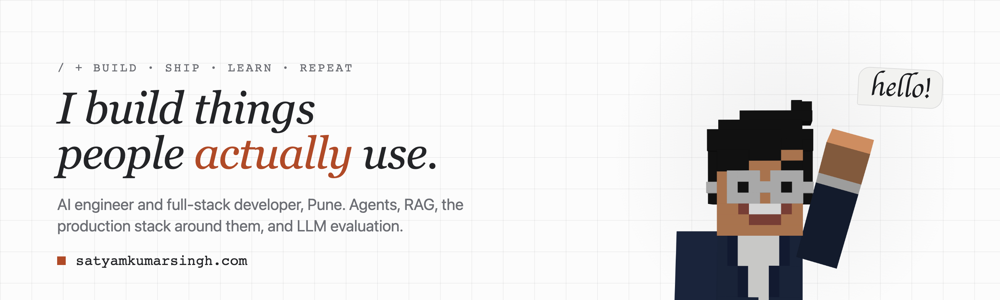
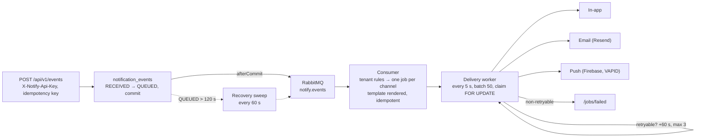
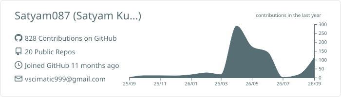
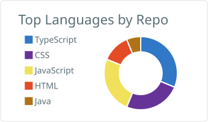
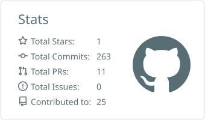

<picture>
  <source media="(prefers-color-scheme: dark)" srcset="assets/banner-dark.png">
  
</picture>

  
  
  
  
  

I build agents and RAG systems, ship the full stack around them (Java, Node, React, React Native), and evaluate LLM workflows for a living. Second-year B.Tech CSE (AI) at Vedam School of Technology, Pune. Every number on this page links to the query, run file or commit that produced it.

## Now

| | | |
|---|---|---|
| **Full Stack Developer Intern** | Third Shade Media, Jun 2026 → | Sole engineer on Humraah: one Node backend, a PWA and an Expo app, taken from a failed 40-finding security audit to App Store and Play review in ten weeks. |
| **LLM Evaluation Expert (Certified)** | Deccan AI Experts, Jun 2026 → | Evaluating terminal-based and agentic LLM workflows for correctness and reproducibility. |
| **Co-founder, Payments and Infrastructure** | CampusCritique, Apr 2026 → | Payments, notifications, admissions automation. 1.1K users, 15 of 15 paid sessions completed. |

## Measured

<table>
<tr>
<td align="center" width="33%"><a href="https://satyamkumarsingh.com/work/notify"><b>98.1%</b></a> of 1,346 notification jobs delivered Notify · Java, RabbitMQ · production since May 2026</td>
<td align="center" width="33%"><a href="https://satyamkumarsingh.com/work/oiltrace"><b>0.35 vs 0.06</b></a> Dice against the classical baseline, look-alike traps inside validation OilTrace · PyTorch U-Net · SIH 2026 internal winner</td>
<td align="center" width="33%"><a href="https://satyamkumarsingh.com/lab"><b>56 / 56</b></a> on a published RAG benchmark, 7 adversarial, recall@8 100%, MRR 0.97 Ask this site · the search box on my portfolio</td>
</tr>
</table>

## How Notify works

The system behind the 98.1%. A product posts an event and gets a 202; everything after that is Notify's problem.

<b>The six decisions, one line each</b>

- **Commit, then publish, then sweep.** The event row is the outbox; a stale `QUEUED` row is the signal to republish. No distributed transaction.
- **Idempotent at every hop.** Idempotency key at ingest; `existsByEventIdAndChannel` plus a unique constraint at fan-out; row lock at claim.
- **Claim and finalise one job at a time**, each in its own transaction, so one failure cannot roll back deliveries that already happened.
- **Failures are classified by the handler** (`DeliveryException(message, retryable)`); the worker retries exactly what can change on a retry.
- **Off by default.** Email and push stay disabled until credentials exist; misconfiguration fails startup, not delivery at 2am.
- **Templates in Postgres per tenant**, versioned by Flyway migration, with a render-test endpoint.

Source: [Satyam087/notify](https://github.com/Satyam087/notify) · write-up: [What 1,346 notification jobs taught me about async delivery](https://satyamkumarsingh.com/writing/1346-notification-jobs)

<b>What broke, and what changed because of it</b>

| Where | What | Then |
|---|---|---|
| Notify | 25 of 1,346 jobs failed, all email and push | Failure classification, three attempts with backoff, a public failed-jobs view and a live delivery rate |
| OilTrace | Early runs collapsed to predicting nothing (Dice 0.00, precision 1.00) | Focal loss on the wrong pixels, 685 trap scenes moved into validation, a sealed test set never used for a decision |
| CampusCritique | 15 June: a one-line guard routed every payment webhook to the refund handler, and returned 200 | Verify, key, guard, then act; side effects moved out of the request; [the write-up](https://satyamkumarsingh.com/writing/webhook-refund-handler) |
| Humraah | 40 findings in a product that looked finished | Auth rebuilt, media made private, 35 fixed, 5 accepted as non-blocking, then store review |

## Repositories worth opening

| Repository | What it is | Stack |
|---|---|---|
| [**notify**](https://github.com/Satyam087/notify) | Multi-tenant notification service: commit-then-publish with a recovery sweep, idempotent fan-out, classified retries, tenant-scoped API keys, a metrics endpoint feeding a live public ledger. In production since May 2026. | Java 21, Spring Boot 3.5, RabbitMQ, PostgreSQL, Flyway, Docker |
| [**AltaHack**](https://github.com/Satyam087/AltaHack) | KisanMind: five-node LangGraph advisor for farmers with Hindi and Marathi voice, built in 24 hours, 152 tests. Top 2 of about 40 teams at HackWarts. | Python, LangGraph, FastAPI, Gemini, Sarvam, Next.js |
| [**BookCompanion**](https://github.com/Satyam087/BookCompanion) | PageNotes: a reading-path planner over the Open Library API. No UI library, no router library; edge cases designed rather than ignored. | React 19, Vite |
| [**webRTC**](https://github.com/Satyam087/webRTC) | The LiveKit video layer for an AI interview platform: room-scoped tokens minted server-side, Express API, Next.js client. | LiveKit, Next.js, Express, MongoDB |

Elsewhere: [OilTrace](https://github.com/TrueMan08/Team_AlgoRise_OilSpill_detection) (the detector, service and dashboard, every training run's history committed) · [AskMyNotes](https://github.com/VKS0104/AskMyNotes-AlgoRise) (first place, Noesis Hackathon; I co-built the retrieval). The portfolio itself is a private repo; [how it works](https://satyamkumarsingh.com/site) is public.

## Writing

<!-- BLOG-POST-LIST:START -->
- [What 1,346 notification jobs taught me about async delivery](https://satyamkumarsingh.com/writing/1346-notification-jobs)
- [I built a RAG system for my own portfolio, then published its evaluation](https://satyamkumarsingh.com/writing/rag-for-my-own-portfolio)
- [The webhook that routed every payment to the refund handler](https://satyamkumarsingh.com/writing/webhook-refund-handler)
<!-- BLOG-POST-LIST:END -->

This list updates itself from the site's RSS feed once a day (GitHub Action).

## Stack

Plus the AI layer the icons don't have: LangGraph, LangChain, RAG with calibrated thresholds, embeddings and vector search (bge-m3, Gemini, ChromaDB), LLM evaluation (recall@k, MRR, adversarial sets), Gemini, OpenAI and Groq APIs, Sarvam and Whisper for voice.

<b>Ask me about</b>

- Why a queue between ingest and delivery, and why commit-then-publish beats publish-then-commit.
- How to calibrate a RAG similarity threshold with numbers instead of a guess, and why the threshold belongs to the embedding model.
- What a payment webhook has to survive: duplicates, reordering, refunds through the same pipe, a gateway that never retries a 200.
- Why focal loss when Dice loss collapses to the empty mask, and why look-alikes belong inside the validation set.
- Taking a React Native app through App Store and Play review: IAP on both stores, UGC compliance, reviewer accounts.
- One backend, three clients: keeping a notification policy in one place across in-app, push, email and WhatsApp.

## Activity

<picture>
  <source media="(prefers-color-scheme: dark)" srcset="https://raw.githubusercontent.com/Satyam087/Satyam087/output/github-contribution-grid-snake-dark.svg">
  
</picture>

The cards and the graph are regenerated by GitHub Actions in this repository, weekly. Most of September 2026 is in a private repository (this portfolio).

---

Currently watching <i>Bleach: Thousand-Year Blood War</i>, reading <i>Blue Lock</i>. LeetCode 1515 · CodeChef 2★ 1425 · Pune, IST (UTC+5:30), US and EU overlap. 
Open to remote AI engineering, full-stack and SDE roles: internship, contract or full-time. <a href="https://satyamkumarsingh.com/contact">Say hello</a>, delivery traced live by Notify.

